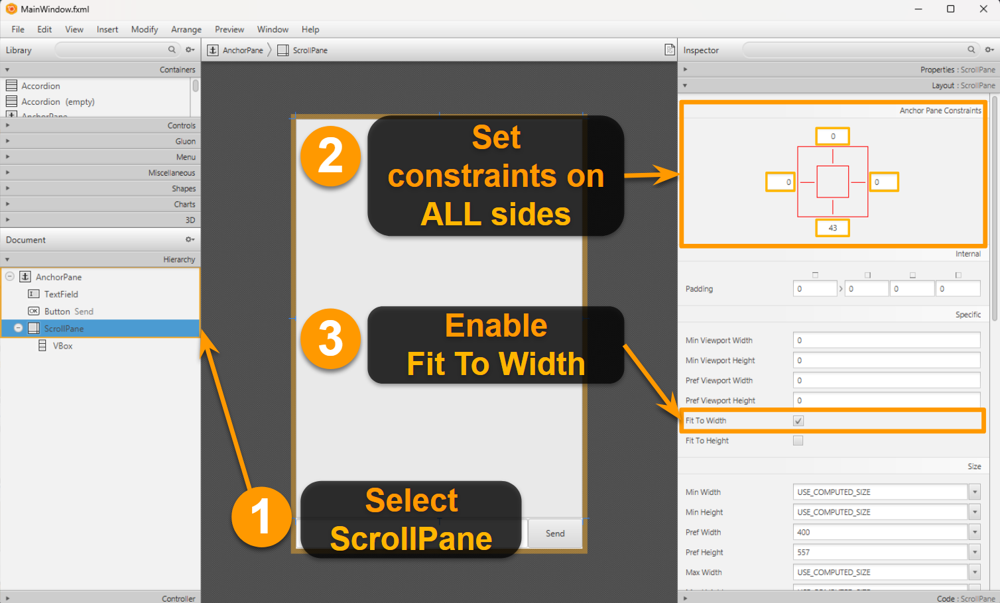
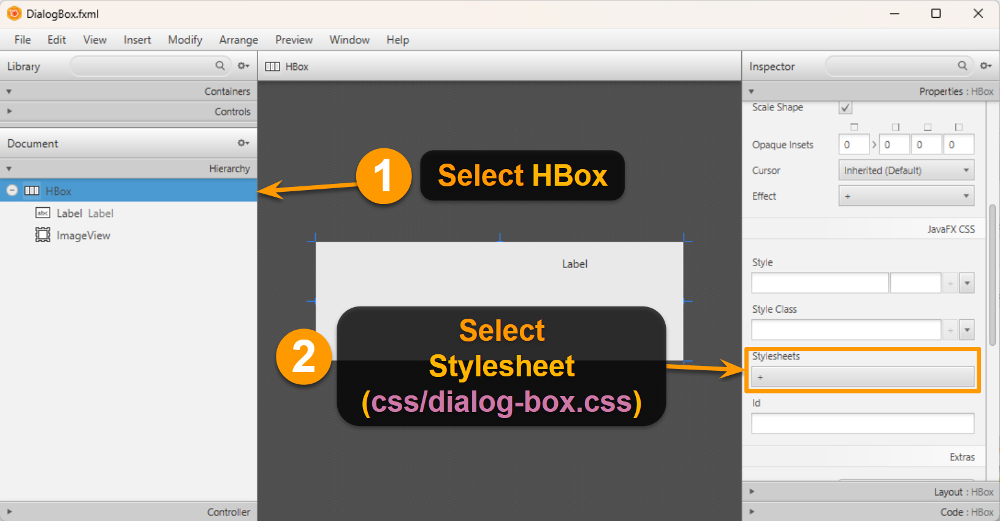
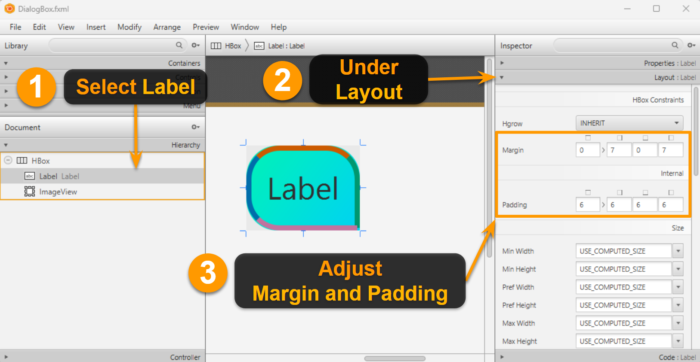
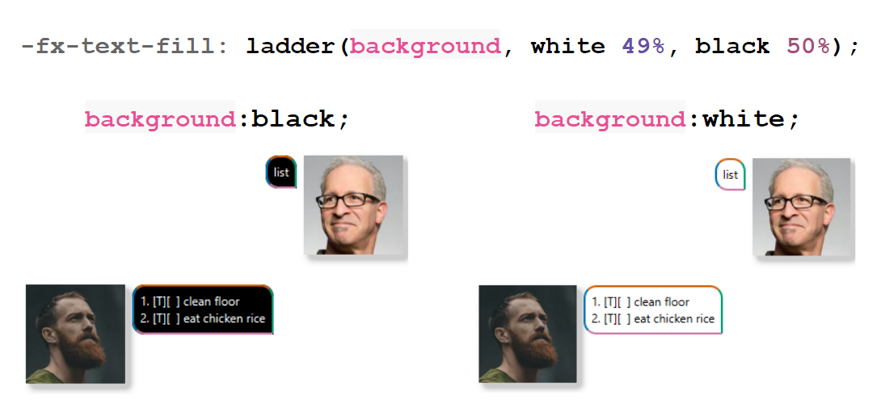
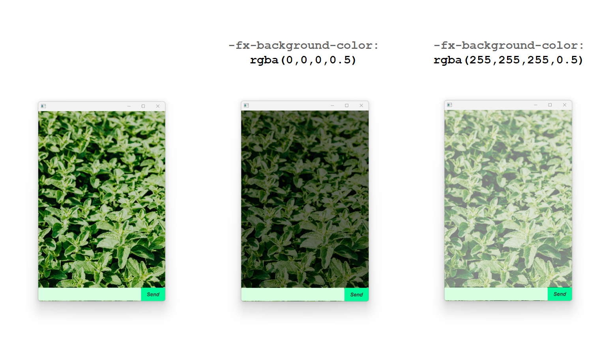

<frontmatter>
  title: "JavaFX tutorial part 5 – Tweaking the GUI"
  pageNav: 3
</frontmatter>

# JavaFX tutorial part 5 – Tweaking the GUI
<div style="color:gray; margin:0 0 20px 0; font-size:10px">Last updated: 8/6/2024 </div>

This part of the tutorial aims to help you with some of the layout/CSS related stuff so that you may focus more on designing your own GUI. As this guide is kind of long, it can feel daunting to get started, especially for the CSS sections. Therefore, feel free to only look at the sections that interests you. [This section](#setting-up-and-linking-css-to-fxml) containing the CSS dummy code and linking it to SceneBuilder might be the most helpful.

# Setting the dimensions
As you may have noticed, some of the elements does not automatically follow the dimension of the app when resizing:
- `TextField` does not automatically resize horizontally
- `Send Button` does not follow to bottom right of the app
- `ScrollPane` does not automatically resize both horizontally and vertically

<video oncontextmenu="return false;" width="100%" autoplay muted loop>
   <source src="videos/javafx/DoesNotFollowDimensionsDemo.mp4" type="video/mp4">
</video>

To rectify this, we can use a mixture of the following two techniques:
1) [Automatically anchor nodes to the dimensions](#automatically-resize-elements)
2) [Limit the user from resizing certain window dimensions](#setting-limit-to-window-size)


## Automatically Resize Elements

We want to [anchor](https://docs.oracle.com/javase/8/javafx/api/javafx/scene/layout/AnchorPane.html) the following nodes:
- [Anchor `TextField`](#anchor-textfield) to the bottom while also automatically resize horizontally
- [Anchor `Send Button`](#anchor-send-button) to the bottom right of the app
- [Anchor `ScrollPane`](#anchor-scrollpane) to resize both horizontally and vertically

We can do this in FXML. Alternatively, we can do this in SceneBuilder, as shown in later sections.

```fxml {heading="**MainWindows.fxml**" start-from=1 highlight-lines="11, 12, 13"}
<?xml version="1.0" encoding="UTF-8"?>

<?import javafx.scene.control.Button?>
<?import javafx.scene.control.ScrollPane?>
<?import javafx.scene.control.TextField?>
<?import javafx.scene.layout.AnchorPane?>
<?import javafx.scene.layout.VBox?>

<AnchorPane maxHeight="-Infinity" maxWidth="-Infinity" minHeight="-Infinity" minWidth="-Infinity" prefHeight="600.0" prefWidth="400.0" xmlns="http://javafx.com/javafx/20.0.1" xmlns:fx="http://javafx.com/fxml/1" fx:controller="MainWindow">
  <children>
    <TextField fx:id="userInput" layoutY="558.0" onAction="#handleUserInput" prefHeight="41.0" prefWidth="324.0" AnchorPane.bottomAnchor="1.0" AnchorPane.leftAnchor="0.0" AnchorPane.rightAnchor="76.0" />
    <Button fx:id="sendButton" layoutX="324.0" layoutY="558.0" mnemonicParsing="false" onAction="#handleUserInput" prefHeight="41.0" prefWidth="76.0" text="Send" AnchorPane.bottomAnchor="1.0" AnchorPane.rightAnchor="0.0" />
    <ScrollPane fx:id="scrollPane" fitToWidth="true" hbarPolicy="NEVER" hvalue="1.0" prefHeight="557.0" prefWidth="400.0" vvalue="1.0" AnchorPane.bottomAnchor="43.0" AnchorPane.leftAnchor="0.0" AnchorPane.rightAnchor="0.0" AnchorPane.topAnchor="0.0">
      <content>
        <VBox fx:id="dialogContainer" prefHeight="552.0" prefWidth="388.0" />
      </content>
    </ScrollPane>
  </children>
</AnchorPane>

```

### Anchor TextField
Open `src/main/resources/view/MainWindow.fxml` in SceneBuilder and click on `TextField`. On the right accordion pane you should be able to see the AnchorPane constraints of the `TextField`.


Children within `AnchorPane` are able to "anchor" their edges to the `AnchorPane` itself if a constraint is set.

Since we want to automatically resize the `TextField` horizontally (but not vertically) whenever we resize the window, we need to put an anchor constraint on the **left and right edges**. Click on the left and right boxes as shown below, and it will automatically set a value based on its current position relative to the AnchorPane. Note that the right side is set to 76 as this is the width of the button next to it.


Save `MainWindow.fxml` and run to test your app out to see if it works when you resize the window.

**Anchored [TextField](#anchor-textfield):**

<video oncontextmenu="return false;" width="100%" autoplay muted loop>
   <source src="videos/javafx/AnchoredTextField.mp4" type="video/mp4">
</video>

Alternatively, we can adjust in this line in the [FXML code](#automatically-resize-elements) as highlighted (scroll to the right):
```fxml {heading="**MainWindows.fxml**" start-from=11 highlight-lines=11[6::9]}
    <TextField fx:id="userInput" layoutY="558.0" onAction="#handleUserInput" prefHeight="41.0" prefWidth="324.0" AnchorPane.bottomAnchor="1.0" AnchorPane.leftAnchor="0.0" AnchorPane.rightAnchor="76.0" />
```

### Anchor Send Button

Since we want to anchor the button to the bottom right corner of the window, we set the anchor values for the **bottom and right** side.


Save `MainWindow.fxml` and run to test your app out to see if it works when you resize the window.

**Anchored [TextField](#anchor-textfield) and [Send Button](#anchor-send-button):**

<video oncontextmenu="return false;" width="100%" autoplay muted loop>
   <source src="videos/javafx/AnchoredSendButton.mp4" type="video/mp4">
</video>

Alternatively, we can adjust in this line in the [FXML code](#automatically-resize-elements) as highlighted (scroll to the right):
```fxml {heading="**MainWindows.fxml**" start-from=12 highlight-lines=12[9::11]}
    <Button fx:id="sendButton" layoutX="324.0" layoutY="558.0" mnemonicParsing="false" onAction="#handleUserInput" prefHeight="41.0" prefWidth="76.0" text="Send" AnchorPane.bottomAnchor="1.0" AnchorPane.rightAnchor="0.0" />
```

### Anchor ScrollPane
Since we want to resize the chat both horizontally and vertically, we set the anchor pane constraints to **all** edges.

At the same time we **enable Fit To Width** so that the content within the `ScrollPane` resize as well.



Save `MainWindow.fxml` and run to test your app out to see if it works when you resize the window.

**Anchored [TextField](#anchor-textfield), [Send Button](#anchor-send-button) and [ScrollPane](#anchor-scrollpane):**

<video oncontextmenu="return false;" width="100%" autoplay muted loop>
   <source src="videos/javafx/AnchoredScrollPane.mp4" type="video/mp4">
</video>

Alternatively, we can adjust in this line in the [FXML code](#automatically-resize-elements) as highlighted (scroll to the right):
```fxml {heading="**MainWindows.fxml**" start-from=13 highlight-lines="13[2::3], 13[8::12]"}
    <ScrollPane fx:id="scrollPane" fitToWidth="true" hbarPolicy="NEVER" hvalue="1.0" prefHeight="557.0" prefWidth="400.0" vvalue="1.0" AnchorPane.bottomAnchor="43.0" AnchorPane.leftAnchor="0.0" AnchorPane.rightAnchor="0.0" AnchorPane.topAnchor="0.0">
```

## Setting limit to Window size

If you don't want the user to be able to resize the window below certain limits, you can set the minimum height and width.

If you don't want to let the user resize horizontally, you can set the maximum width = minimum width.

Update the `start` method as shown below.

```java {heading="**Main.java**" highlight-lines="4-5"}
public void start(Stage stage) {
    try {
        // current code...
        stage.setMinHeight(220);
        stage.setMinWidth(417);
        // stage.setMaxWidth(417); // Add this if you didn't automatically resize elements
        fxmlLoader.<MainWindow>getController().setDuke(duke);
        stage.show();
    } catch (IOException e) {
        e.printStackTrace();
    }
}
```

# Customize with JavaFX CSS!

Suppose you want to customize colors, shapes, borders, and other design elements.
The most effective way to do this is through CSS, so this will be a mini [**JavaFX CSS**](https://docs.oracle.com/javafx/2/api/javafx/scene/doc-files/cssref.html)
introductory guide.
<box type="tip" seamless>

If you are new to CSS entirely, a quick way to learn the basics is either through this [YouTube tutorial](https://www.youtube.com/watch?v=o-lAsVuskKI) or through this [quick guide](https://www.w3schools.com/css/css_intro.asp). Alternatively, you can look through all the syntax through this [JavaFX CSS reference guide](https://docs.oracle.com/javafx/2/api/javafx/scene/doc-files/cssref.html)
</box>

## Setting up and linking CSS to FXML

Create the following files in `src/main/resources/css`:

```css {heading="**main.css**" start-from=1}
.root {
    main-color: rgb(237, 255, 242);       /* Create a looked-up color called "main-color" within root. */
    -fx-background-color: main-color;
}

.text-field {
    -fx-background-color: #d9ffe2;
    -fx-font: 20px "Arial";
}

.button {
    -fx-background-color: mediumspringgreen;
    -fx-font: italic bold 16px "Arial";
}

.button:hover {
    -fx-background-color:cyan;
    -fx-font-size: 18px;
}

.button:pressed {
    -fx-background-color:orange;
    -fx-font-size: 20px;
}

.scroll-pane,
.scroll-pane .viewport {
    -fx-background-color: transparent;
}

.scroll-bar {
    -fx-font-size: 10px;  /* Change width of scroll bar. */
    -fx-background-color: main-color;
}

.scroll-bar .thumb {
    -fx-background-color: #ff9cb4;
    -fx-background-radius: 1em;
}

/* Hides the increment and decrement buttons. */
.scroll-bar .increment-button,
.scroll-bar .decrement-button {
    -fx-pref-height: 0;
    -fx-opacity: 0;
}

```

```css {heading="**dialog-box.css**" start-from=1}
.label {
    -fx-background-color: linear-gradient(to bottom right, #00ffbf, #00ddff);
    -fx-border-color: #d55e00 #009e73 #cc79a7 #0072b2;
    -fx-border-width: 2px;
    -fx-background-radius: 1em 1em 0 1em;
    -fx-border-radius: 1em 1em 0 1em;
}

.reply-label {
    -fx-background-radius: 1em 1em 1em 0;
    -fx-border-radius: 1em 1em 1em 0;
}

#displayPicture {
    /* Shadow effect on image. */
    -fx-effect: dropshadow(gaussian, rgba(0, 0, 0, 0.2), 10, 0.5, 5, 5);

    /* Change size of image. */
    -fx-scale-x: 1;
    -fx-scale-y: 1;

    /* Rotate image clockwise by degrees. */
    -fx-rotate: 0;
}

```

Proceed with the following steps to link the CSS files to the FXML files through SceneBuilder.

1. Open `MainWindow.fxml` in SceneBuilder, select the `AnchorPane`.

2. On the right accordion pane, click on the plus sign under Stylesheets within Properties as shown below and choose the previously created `src/main/resources/css/main.css` file.
   

3. If you don't see this updated view, try **saving**, then reopening the file with SceneBuilder again.
   <box type="important" seamless bold>

   **Remember to save the `.fxml` file after linking!**
   </box>

   


4. Repeat steps 1-3 for `DialogBox.fxml` with `dialog-box.css`.
   

5. **Save the FXML files** and run the app to test it!
   <pic src="images/javafx/DefaultDukeCSSApp.png" height="600" />

### Flipped text bubbles

You may have noticed that the text bubbles are not facing the right direction for DaDuke.
<pic src="images/javafx/WrongTextBubbleDirectionForDaDuke.png" height="160" />

We created a style class specifically for this case:


```css {heading="**dialog-box.css**" start-from=9}
.reply-label {
    -fx-background-radius: 1em 1em 1em 0;
    -fx-border-radius: 1em 1em 1em 0;
}
```

We can add the `.reply-label` style to the dialog box when we flip the message for DaDuke.

Update the following code:

```java {heading="**DialogBox.java**" start-from=46}
 private void flip() {
     // current code...
     dialog.getStyleClass().add("reply-label");
 }
```

## Padding and Margin

In short, padding represents the space between the content and its border, while margin represents the invisible space around the border.


Let us play around with the padding and margin of the text bubble.

Open `DialogBox.fxml` in SceneBuilder. Click on `Label`, and look at layout in the right accordion panel.



<box type="tip" seamless>

Default controls for zooming and zooming out in SceneBuilder

Zoom in: `[CTRL] + [+]` or `[ALT] + [⌘] + [=]`

Zoom out: `[CTRL] + [/]` or `[ALT] + [⌘] + [-]`
</box>

Margin and padding used in this example:
- `Margin`: 0, 7, 0, 7
- `Padding`: 6, 6, 6, 6

_Alternatively_, we can update in the **FXML code**:

```fxml {heading="**view/DialogBox.fxml**" start-from=10}
    <Label fx:id="dialog" text="Label" wrapText="true">
         <HBox.margin>
            <Insets left="7.0" right="7.0" />
         </HBox.margin>
         <padding>
            <Insets bottom="6.0" left="6.0" right="6.0" top="6.0" />
         </padding></Label>
```

_Alternatively alternatively_, we can update in the **CSS code**:

```css {heading="**css/dialog-box.css**" start-from=1 highlight-lines=7,8,9}
.label {
    -fx-background-color: linear-gradient(to bottom right, #00ffbf, #00ddff);
    -fx-border-color: #d55e00 #009e73 #cc79a7 #0072b2;
    -fx-border-width: 2px;
    -fx-background-radius: 1em 1em 0 1em;
    -fx-border-radius: 1em 1em 0 1em;
    -fx-padding: 6px;
    -fx-border-insets: 0px 7px 0px 7px;
    -fx-background-insets: 0px 7px 0px 7px;
}
```

<box type="warning" seamless>

Unfortunately, there is no JavaFX CSS property for margin. We can combine [`fx-border-insets`](#borders) with [`fx-background-insets`](https://stackoverflow.com/questions/42468235/what-does-the-property-fx-background-insets-mean-and-all-means-of-its-params) to simulate margin. 
</box>

Play around with the padding and margin and find the parameters that is most suitable for you!

To **view the effects of the margin**, you may either
- Run the app
- Select both `ImageView` and `Label` to view the distance between them
  

## Borders

Labels, TextBoxes, Buttons, more or less all the nodes used so far are subclasses of [Region](https://docs.oracle.com/javafx/2/api/javafx/scene/doc-files/cssref.html#region), and hence share the following CSS properties for borders:

| CSS property        | Description                                                    | 
|---------------------|----------------------------------------------------------------|
| `-fx-border-color`  | Set border color.                                              |
| `-fx-border-radius` | Set the "roundedness" of the border.                           |
| `-fx-border-width`  | Set border thickness.                                          |
| `-fx-border-style`  | Set style of border (e.g., can be dashed or bolded).           |
| `-fx-border-insets` | Set space between the border and the outer edge of the region. |

For _all_ of these properties, you can either set a single value to apply to all corners/sides, or you can set them individually on each corner/side. To demonstrate this, let us take a look at the following code for our text bubble:

```css {heading="**css/dialog-box.css**" start-from=1 highlight-lines=3-6}
.label {
    -fx-background-color: linear-gradient(to bottom right, #00ffbf, #00ddff);
    -fx-border-color: #d55e00 #009e73 #cc79a7 #0072b2;
    -fx-border-width: 2px;
    -fx-background-radius: 1em 1em 0 1em;
    -fx-border-radius: 1em 1em 0 1em;
}
```

For `fx-border-width`, a single value is used, so the value `2px` is applied to all sides.

For `fx-border-color`, `fx-background-radius`, `fx-border-radius`, there are 4 values used. The values are set in a **clockwise** manner starting from the **top left corner/top edge**.

<div style="text-align: center;">
  
</div>

## Color

There are a few ways to set a color.
1. Using [`rgb` / `rgba`](#rgb-or-rgba)
2. Using [HEX `#ffffff`](#HEX)
3. Using an existing [named color](https://docs.oracle.com/javafx/2/api/javafx/scene/doc-files/cssref.html#typecolor)
4. Using your own defined [(looked-up) color](#looked-up-color)
5. Using [gradients](#gradient-color)
6. Using a [ladder](#ladder) to change color based on background
7. Using [derive](#derive) to get a brighter or darker version of selected color

These are the common JavaFX properties to set colors:
- `-fx-border-color`
- `-fx-text-fill` (set text color)
- `-fx-background-color`

### RGB or RGBA

RGB represents Red Green Blue, and each color takes in a value **between 0 and 255**.

```css
-fx-text-fill: rgb(247, 124, 146) /* Light pinkish red color */
```

RGBA on the other hand represents Red Green Blue Alpha, where **alpha represents the opacity**. And it takes in a value **between 0 and 1**.

In this example, the opacity is set to 50% (0.5). You can test it out with `.label` in `dialog-box.css`!
```css
-fx-background-color: rgba(0, 0, 0, 0.5) /* Black with opacity of 0.5 */
```

### HEX

Note that since each color (red, green, blue) values are from 0 to 255. This can be represented from **0 to FF**! You can learn more about hexadecimals [here](https://byjus.com/maths/hexadecimal-number-system/). The format for hex is `#rrggbb`.

```css
-fx-background-color:#f77c92 /* Light pinkish red color */
```

You can also set with a **shorter format**. 
```css
-fx-background-color:#fb2 /* Equivalent to #ffbb22 */
-fx-background-color:#fff /* Equivalent to #ffffff */
```

### Looked-up Color
You can **define a color** within the `.root` selector, which can be referenced by other classes within the stylesheet.

```css {heading="**css/main.css**"}
.root {
    main-color: rgb(237, 255, 242);     /* Create a looked-up color called "main-color" within root */
    -fx-background-color: main-color;
}

.scroll-bar {
    ...
    -fx-background-color: main-color;   /* Using looked-up color */
}
```

### Gradient color

To set a [gradient color](https://docs.oracle.com/javafx/2/api/javafx/scene/doc-files/cssref.html#typepaint), we can either use linear or radial gradient.

<div style="overflow-x:auto">
   <table style="margin:0 0 10px 0; border:none">
   <tbody>
   <tr>
   <td style="border:none">
   
   **Linear Gradient**
   </td>
   <td style="border:none">
   
   </td>
   <td style="border:none">
   
   ```css
   -fx-background-color: linear-gradient(to bottom right, red, blue);
   ```
   </td>
   </tr>
   <tr>
   <td style="border:none">
   
   **Radial Gradient**
   </td>
   <td style="border:none">
   
   </td>
   <td style="border:none">
   
   ```css
   -fx-background-color: radial-gradient(radius 100%, red, yellow, blue);
   ```
   </td>
   </tr>
   </tbody>
   </table>
</div>

### Ladder

We can also automatically change color based on the **brightness level of a specific color**. To demonstrate this, let us temporarily update the code:

```css {heading="**css/dialog-box.css**" start-from=1 highlight-lines="2, 3, 8"}
.label {
    background:white;
    -fx-background-color: background;
    -fx-border-color: #d55e00 #009e73 #cc79a7 #0072b2;
    -fx-border-width: 2px;
    -fx-background-radius: 1em 1em 0 1em;
    -fx-border-radius: 1em 1em 0 1em;
    -fx-text-fill: ladder(background, white 49%, black 50%);
}
```

This line means that the font color will turn <span style="background: black; color: white">**white**</span> if the **brightness** of `background` color is between <span style="color:#674ea7">**0%-49%**</span>, and it will turn <span style="background: white; color: black">**black**</span>  if the brightness level is between <span style="color:#a64d79">**50%-100%**</span>.



### Derive

We can set a **brighter or darker** color based on a specific color.

<div style="overflow-x:auto">
   <table style="margin:0 0 10px 0; border:none">
   <tbody>
   <tr>
   <td style="background:#00f; width:80px; height: 80px; border:none;"></td>
   <td style="border:none; padding:0 70px 0 15px;">
   
   ```css
   -fx-background-color: derive(blue, 0);
   ```
   </td>
   </tr>
   <tr>
   <td style="background:#4c4cff; width:80px;border:none;"></td>
   <td style="border:none; padding:0 70px 0 15px;">
   
   ```css
   -fx-background-color: derive(blue, 0.5);
   ```
   </td>
   <td style="background:#0000b2; width:80px; height:80px; border:none;"></td>
   <td style="border:none">
   
   ```css
   -fx-background-color: derive(blue, -0.5);
   ```
   </td>
   </tr>
   <tr>
   <td style="background:#9999ff; width:80px;border:none;"></td>
   <td style="border:none; padding:0 70px 0 15px;">
   
   ```css
   -fx-background-color: derive(blue, 1);
   ```
   </td>
   <td style="background:#006; width:80px; height:80px; border:none;"></td>
   <td style="border:none">
   
   ```css
   -fx-background-color: derive(blue, -1);
   ```
   </td>
   </tr>
   <tr>
   <td style="background:#e5e5ff; width:80px;border:none;"></td>
   <td style="border:none; padding:0 70px 0 15px;">
   
   ```css
   -fx-background-color: derive(blue, 1.5);
   ```
   </td>
   <td style="background:#000019; width:80px; height:80px; border:none;"></td>
   <td style="border:none">
   
   ```css
   -fx-background-color: derive(blue, -1.5);
   ```
   </td>
   </tr>
   <tr>
   <th style="background:#FFF; width:80px;border:none;"></th>
   <td style="border:none; padding:0 70px 0 15px;">
   
   ```css
   -fx-background-color: derive(blue, 2);
   ```
   </td>
   <td style="background:#000; width:80px; height:80px; border:none;"></td>
   <td style="border:none">
   
   ```css
   -fx-background-color: derive(blue, -2);
   ```
   </td>
   </tr>
   </tbody>
   </table>
</div>


## States

You can set different properties for different states of a node.

For example, let us take a look at the send button:

```css {heading="**css/main.css**" start-from=11 highlight-lines="16[':hover'], 21[':pressed']"}
.button {
    -fx-background-color:springgreen;
    -fx-font: italic bold 16px "Arial";
}

.button:hover {
    -fx-background-color:cyan;
    -fx-font-size: 18px;
}

.button:pressed {
    -fx-background-color:orange;
    -fx-font-size: 20px;
}
```

In this case, there are three different states:
-  Default, when nothing happens to the button
- `:hover`, when your mouse hovers the button
- `:pressed`, when you click on the button

<video oncontextmenu="return false;" width="100%" autoplay muted loop>
   <source src="videos/javafx/ButtonStatesDemo.mp4" type="video/mp4">
</video>

This works for TextFields/Labels/Images as well.

Other state(s) include:

- `:focused`, when the node is selected (e.g., selecting the TextField)


## Image and shadows

Since an ImageView is a [node](https://docs.oracle.com/javafx/2/api/javafx/scene/doc-files/cssref.html#node), we can play around with the size, opacity, rotation, and more. This also means that the following properties can also be used for other kind of nodes.


```css {heading="**css/dialog-box.css**" start-from=14}
#displayPicture {
    /* Shadow effect on image. */
    -fx-effect: dropshadow(gaussian, rgba(0, 0, 0, 0.2), 10, 0.5, 5, 5);

    /* Change size of image. */
    -fx-scale-x: 1;
    -fx-scale-y: 1;

    /* Rotate image clockwise by degrees. */
    -fx-rotate: 0;
}
```


<box type="info" seamless>

Note that the `#` symbol is used to select the node by its ID (or variable),
meaning it applies the style to just `displayPicture` and not to `ImageView`s in general.
This is different from using a class selector (which uses `.`).
</box>

There are 2 different types of [shadow effects](https://docs.oracle.com/javafx/2/api/javafx/scene/doc-files/cssref.html#typeeffect): **Drop shadow** and **Inner shadow**. Additionally, if you use an image with a transparent background (e.g., [this doggy](https://pixabay.com/illustrations/dachshund-dog-hot-dog-animals-6336468/)), the shadow effect will not apply to the transparent areas.

<div style="overflow-x:auto">
   <table style="margin:0 0 20px 0; border:none">
   <tbody>
   <tr>
   <td style="border:none">
   
   **Drop Shadow**
   </td>
   <td style="border:none">
   
    
   </td>
   
   <td style="border:none">
   
   ```css
   -fx-effect: dropshadow(gaussian, rgba(0, 0, 0, 0.2), 10, 0.5, 5, 5);
   ```
   </td>
   </tr>
   <tr>
   <td style="border:none">
   
   **Inner Shadow**
   </td>
   <td style="border:none">
    
   </td>
   <td style="border:none">
   
   ```css
   -fx-effect: innershadow(gaussian, rgba(0, 0, 0, 0.2), 10, 0.5, 5, 5);
   ```
   </td>
   </tr>
   </tbody>
   </table>
</div>

## Java CSS Reference Guide

The [JavaFX CSS reference guide](https://docs.oracle.com/javafx/2/api/javafx/scene/doc-files/cssref.html) is a very helpful way to find out what properties are used for different nodes. You can also see the name of the style classes, like `.label` and
`.text-field`. Additionally, most elements/nodes (including panes) are [Regions](https://docs.oracle.com/javafx/2/api/javafx/scene/doc-files/cssref.html#region), so they inherit those properties as well. 

Some nodes don't have a style class name, like `ImageView`. To customize such nodes, you can either:
- [Create your own style class and the style class manually](#flipped-text-bubbles)
- [Apply style to just that specific node with the id (e.g., `#displayPicture`) instead](#image-and-shadows)

# Enhancements

## Change style dynamically based on command

Let's create different style classes for the following commands:
- Add a task (includes `todo`, `deadline`, and `event`)
- `mark` a task
- `delete` a task

1. Create style classes for each type of commands in `dialog-box.css`.
   ```css {heading="**css/dialog-box.css**"}
   /* Paste this below reply-label */
   .add-label {
       -fx-background-color: yellow;
   }
   
   .marked-label {
       -fx-background-color: palegreen;
   }
   
   .delete-label {
       -fx-background-color: lightpink;
   }
   ```
2. Update the code in `Duke.java` so that we can grab and store the command type.
   <box type="warning" seamless>

   Note that it may look different for your code, so use this as reference instead of copying. 
   </box>

   ```java {heading="**Duke.java**" highlight-lines="2[:], 9[:], 15-17[:]"}
       // ...
       private String commandType;
       // ...
   
       public String getResponse(String input) {
        try {
            Command c = Parser.parse(input);
            c.execute(tasks, ui, storage);
            commandType = c.getClass().getSimpleName();
            return c.getString();
        } catch (DukeException e) {
            return "Error: " + e.getMessage();
        }
       }
       public String getCommandType() {
        return commandType;
       }
   ```
3. Update the code in `MainWindow.java` to pass the command type from `Duke` to `DialogContainer`.  
   ```java {heading="**MainWindow.java**" highlight-lines="5[:], 8[:]"}
    @FXML
    private void handleUserInput() {
        String input = userInput.getText();
        String response = duke.getResponse(input);
        String commandType = duke.getCommandType();
        dialogContainer.getChildren().addAll(
                DialogBox.getUserDialog(input, userImage),
                DialogBox.getDukeDialog(response, dukeImage, commandType)
        );
        userInput.clear();
    }
   ```
4. Update the code in `DialogBox.java` to change the style of `dialog` using `changeDialogStyle`.
   <box type="warning" seamless>

   Note that it may look different for your code, so use this as reference instead of copying.
   </box>

   ```java {heading="**DialogBox.java**" highlight-lines="1-15[:], 13[:]"}
    private void changeDialogStyle(String commandType) {
        switch(commandType) {
        case "AddCommand":
            dialog.getStyleClass().add("add-label");
            break;
        case "ChangeMarkCommand":
            dialog.getStyleClass().add("marked-label");
            break;
        case "DeleteCommand":
            dialog.getStyleClass().add("delete-label");
            break;
        default:
            // Do nothing
        }
    }
    // ...
    public static DialogBox getDukeDialog(String text, Image img, String commandType) {
        var db = new DialogBox(text, img);
        db.flip();
        db.changeDialogStyle(commandType);
        return db;
    }
   ```

5. Run and test it!

   <video oncontextmenu="return false;" width="700px" autoplay muted loop>
   <source src="videos/javafx/DynamicStyleDemo.mp4" type="video/mp4">
   </video>

## Set image as background

We can set an image using CSS. Let's set the background image (in `src/main/resources/images/`) for our `AnchorPane` as follows:

### Resize Image

Resizing but keeping the aspect ratio of the image. 

```css {heading="**css/main.css**" start-from=1 highlight-lines=4}
.root {
    main-color: rgb(237, 255, 242);
    -fx-background-color: main-color;
    -fx-background-image: url("../images/background.jpg"); /* Set image */
    -fx-background-size: cover;
}
```

<video oncontextmenu="return false;" width="700px" autoplay muted loop>
   <source src="videos/javafx/ResizeDemo.mp4" type="video/mp4">
</video>

### Stretch Image

Stretching the background image according to window size. 

```css {heading="**css/main.css**" start-from=1 highlight-lines=5}
.root {
    main-color: rgb(237, 255, 242);
    -fx-background-color: main-color;
    -fx-background-image: url("../images/background.jpg"); /* Set image */
    -fx-background-size: stretch;
}
```

<video oncontextmenu="return false;" width="700px" autoplay muted loop>
   <source src="videos/javafx/ResizeDemo.mp4" type="video/mp4">
</video>

### Repeat Image

We have a few options for how we want to repeat our background image.

<tabs>
   <tab header="Round">

   Pictures only repeat when there is enough space in the background, otherwise it will stretch the pictures.

   ```css {heading="**css/main.css**" start-from=1 highlight-lines=5-6}
   .root {
       main-color: rgb(237, 255, 242);
       -fx-background-color: main-color;
       -fx-background-image: url("../images/background.jpg");
       -fx-background-size: 400px 600px;
       -fx-background-repeat: round;
   }
   ```

   <box type="warning" seamless>

   If the window is smaller than the `-fx-background-size`, the background picture will disappear.
   </box>

   <video oncontextmenu="return false;" width="700px" autoplay muted loop>
       <source src="videos/javafx/RoundDemo.mp4" type="video/mp4">
   </video>
   </tab>
   <tab header="Space">
   Pictures only repeat when there is enough space in the background, otherwise it won't appear. 

   ```css {heading="**css/main.css**" start-from=1 highlight-lines=5-6}
   .root {
       main-color: rgb(237, 255, 242);
       -fx-background-color: main-color;
       -fx-background-image: url("../images/background.jpg");
       -fx-background-size: 400px 600px;
       -fx-background-repeat: space;
   }
   ```

   <video oncontextmenu="return false;" width="700px" autoplay muted loop>
       <source src="videos/javafx/SpaceDemo.mp4" type="video/mp4">
   </video>
   </tab>
   <tab header="Repeat">
   Pictures repeating on both axis.

   ```css {heading="**css/main.css**" start-from=1 highlight-lines=5-6}
   .root {
       main-color: rgb(237, 255, 242);
       -fx-background-color: main-color;
       -fx-background-image: url("../images/background.jpg");
       -fx-background-size: 400px 600px;
       -fx-background-repeat: repeat;
   }
   ```

   <video oncontextmenu="return false;" width="700px" autoplay muted loop>
       <source src="videos/javafx/RepeatDemo.mp4" type="video/mp4">
   </video>
   </tab>
   <tab header="Repeat with Stretch (Combination example)">
   Pictures repeating only on the x-axis while stretching on the y-axis.
   
   ```css {heading="**css/main.css**" start-from=1 highlight-lines=5-6}
   .root {
       main-color: rgb(237, 255, 242);
       -fx-background-color: main-color;
       -fx-background-image: url("../images/background.jpg");
       -fx-background-size: 400px 100%;
       -fx-background-repeat: repeat stretch;
   }
   ```
   
   <box type="warning" seamless>
   
   Remember to put 100% when stretching in that particular axis! 
   </box>
   
   <video oncontextmenu="return false;" width="700px" autoplay muted loop>
       <source src="videos/javafx/RepeatWithStretchDemo.mp4" type="video/mp4">
   </video>
   </tab>
</tabs>


### Changing "Opacity"

We can't directly adjust the opacity of the background image in `.root`. However, we can set a [colored, translucent background](#rgb-or-rgba) in `.scroll-pane` (note that `.scroll-pane` is above `AnchorPane`) to simulate the image opacity. Separate the 2 style classes in `main.css` as follows:

```css {heading="**css/main.css**" start-from=27 highlight-lines=28}
.scroll-pane {
    -fx-background-color: rgba(0,0,0,.5);
}

.scroll-pane .viewport {
    -fx-background-color: transparent;
}

```



## Other things to consider

Here are other things you can do with your app to make it more personalized:
- Add a [placeholder](https://stackoverflow.com/questions/23363222/how-to-set-placeholder-in-javafx) for `TextField` e.g., ("Type here...")
- Change [style for error messages](#change-style-dynamically-based-on-command) 
- Change the [title and icon](https://www.youtube.com/watch?v=UZKKaI8OnjY) of your app
- Change the send button to an [icon](https://edencoding.com/how-to-add-an-image-to-a-button/)
- Make profile pictures [circular](https://stackoverflow.com/questions/42116313/how-to-set-an-image-in-a-circle)
- Set GIF as profile pictures
- Add [sound effects](https://docs.oracle.com/javase/8/javafx/api/javafx/scene/media/AudioClip.html) when sending messages

[:fas-arrow-left: Previous](javaFxPart4.md) | [:fas-arrow-up: **ToC**](javaFx.md)

--------------------------------------------------------------------------------
**Authors:**
* Initial Version: Debbie Hii (@flexibo)
